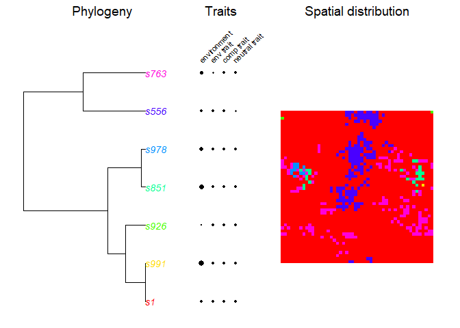
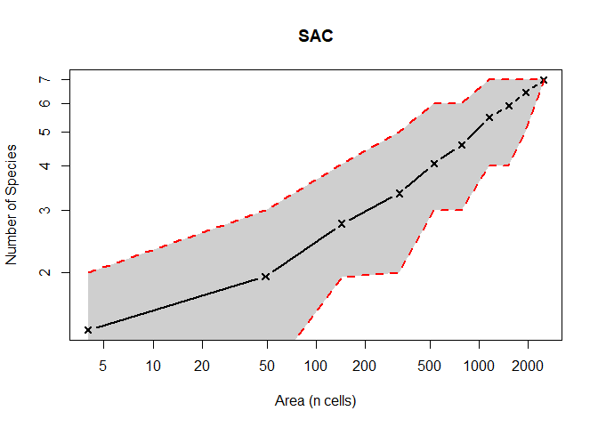

# EcoPhyloSim

A model, provided as an R package, for the simulation of spatially explicit biogeographical and phylogenetic data. 

### Installation 

You can install directly from gh, using the 'devtools' package:


```r
devtools::install_github(repo = "TheoreticalEcology/EcoPhyloSim/", 
                         subdir = "phylosim",  
                         dependencies = T, 
                         build_vignettes = T)

?PhyloSim
browseVignettes("PhyloSim")
```

### Example


```r
library(PhyloSim)

# Define a parameter set
par <- createCompletePar(x = 50, y = 50, dispersal = 1 , runs = 1000,
        density = 0)

# Run the model
simu <- runSimulation(par)
```

```
## [1] "Core simulation finished after 0 minute(s) and 1.71 second(s). Converting data"
## done!
```

```r
plot(simu)
```

<!-- -->

```r
#Look at the species area relation
sac(simu, rep = 100, plot= TRUE)
```

<!-- -->

```
##    size sr.Mean sr.UpperCI sr.LowerCI
## 1     4    1.38       2.00       1.00
## 2    49    1.95       3.00       1.00
## 3   144    2.75       4.05       1.95
## 4   324    3.35       5.00       2.00
## 5   529    4.06       6.00       3.00
## 6   784    4.58       6.00       3.00
## 7  1156    5.49       7.00       4.00
## 8  1521    5.92       7.00       4.00
## 9  1936    6.45       7.00       5.00
## 10 2500    7.00       7.00       7.00
```

