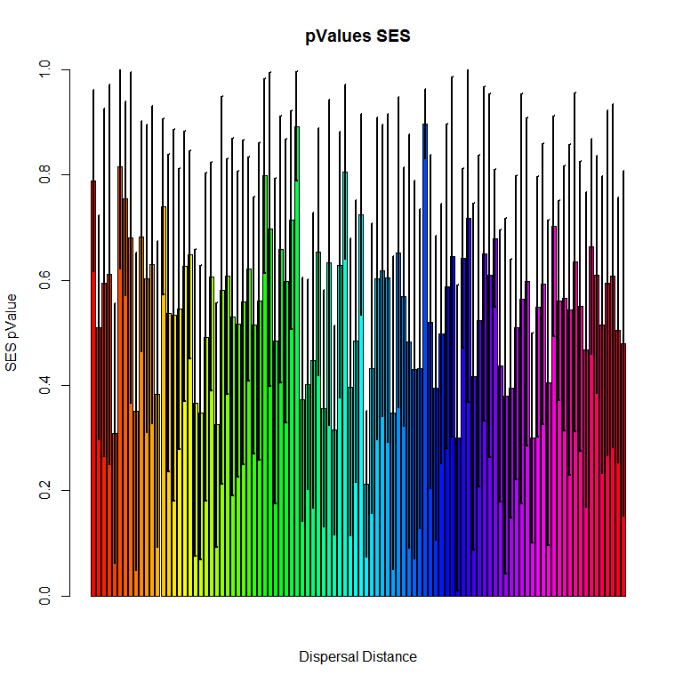
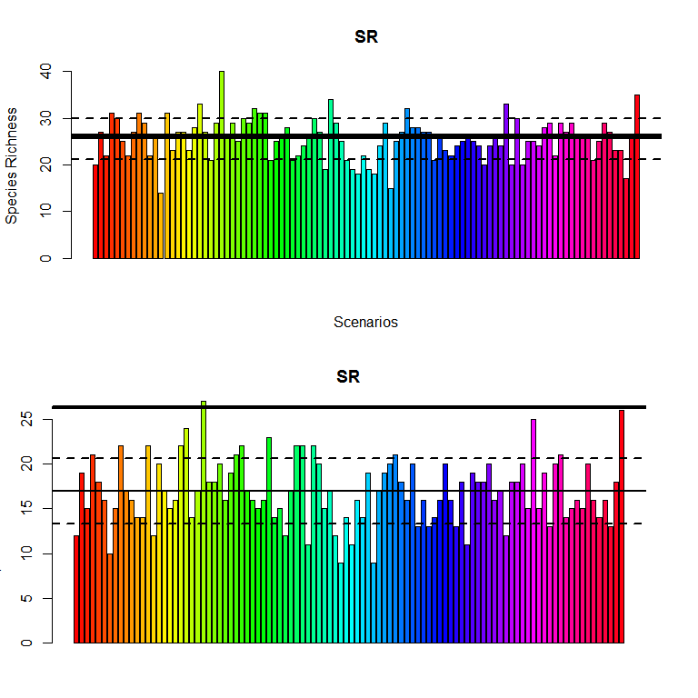
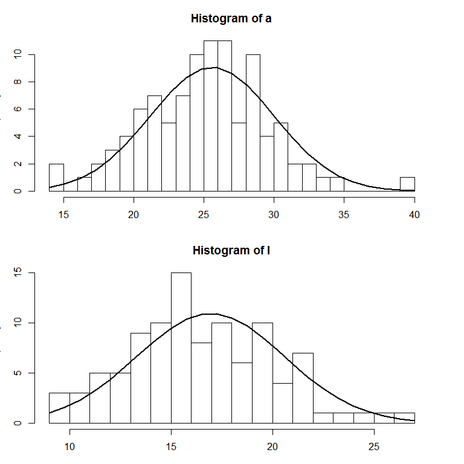
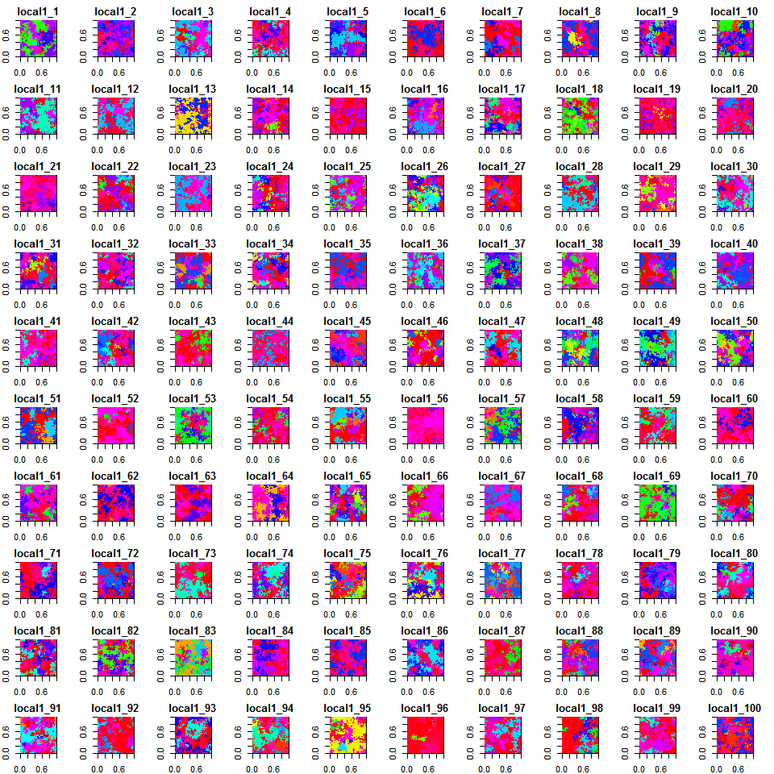
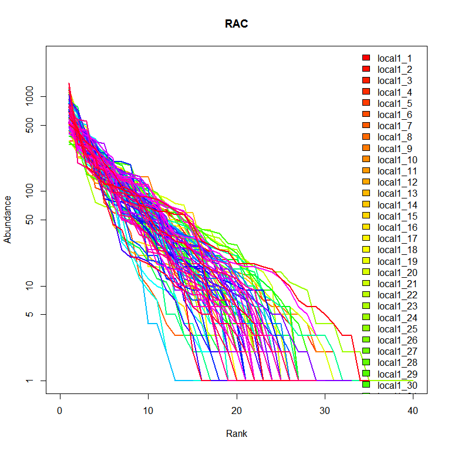

# equilibriumCheck

This is the analysis of 100 simulation runs. 
These runs where conducted with a grid size of 50 by 50 cells. 
Each simulation was run over 100k generations with the same settings. 
The only thing different in each run was the random seed. 
This analysis is designed to assess the variation between simulation runs and to determine whether the model reaches equilibrium. 


```r
require(PhylGeo)
```

```
## Loading required package: PhylGeo
## Loading required package: foreach
```

```r
require(shape)
```

```
## Loading required package: shape
```

```r
require(fields)
```

```
## Loading required package: fields
## Loading required package: spam
## Loading required package: grid
## Spam version 1.0-1 (2014-09-09) is loaded.
## Type 'help( Spam)' or 'demo( spam)' for a short introduction 
## and overview of this package.
## Help for individual functions is also obtained by adding the
## suffix '.spam' to the function name, e.g. 'help( chol.spam)'.
## 
## Attaching package: 'spam'
## 
## The following objects are masked from 'package:base':
## 
##     backsolve, forwardsolve
## 
## Loading required package: maps
```

```r
require(vegan)
```

```
## Loading required package: vegan
## Loading required package: permute
## Loading required package: lattice
## This is vegan 2.3-0
```

```r
require(ape)
```

```
## Loading required package: ape
```

```r
require(picante)
```

```
## Loading required package: picante
## Loading required package: nlme
```

```r
#loading the data
files = character()
for (i in 1:100){
files[i] = paste("local1_", i, collapse = "", sep = "")
}
localList <- list()
for(i in 1:length(files)){
  file <- paste("C:/Users/Paul/Desktop/Data/",files[i], ".rdata", collapse="", sep="")
  load(file)
  localList[[i]] <- OUT
  
}
names(localList) <- files
rm(file, files, i, OUT)
```


```r
pvals <- list()
for(i in 1:length(localList)){
  print(i)
  s <- matrix(localList[[1]]$specOut, nrow = 50, ncol = 50)
  phyl <- read.tree(text = localList[[1]]$phyloOut)
  extantPhylo <- drop.fossil(phy = phyl)
  phy.exta <- cophenetic(extantPhylo)
  set.seed(1500)
  comMat <- localPlots(size = 25, n = 100,matrix = s, community = T)$communityTable
  set.seed(Sys.time())
  SES.mntd.phylogeny.pool <- ses.mpd(comMat, phy.exta, "phylogeny.pool",runs=999)  #4
  # SES.mntd.phylogeny.pool <- ses.pd(comMat, extantPhylo, "richness",runs=999, iterations=1000, include.root = TRUE)  #4
  pvals[[i]] <- SES.mntd.phylogeny.pool
}
```

```
## [1] 1
## [1] 2
## [1] 3
## [1] 4
## [1] 5
## [1] 6
## [1] 7
## [1] 8
## [1] 9
## [1] 10
## [1] 11
## [1] 12
## [1] 13
## [1] 14
## [1] 15
## [1] 16
## [1] 17
## [1] 18
## [1] 19
## [1] 20
## [1] 21
## [1] 22
## [1] 23
## [1] 24
## [1] 25
## [1] 26
## [1] 27
## [1] 28
## [1] 29
## [1] 30
## [1] 31
## [1] 32
## [1] 33
## [1] 34
## [1] 35
## [1] 36
## [1] 37
## [1] 38
## [1] 39
## [1] 40
## [1] 41
## [1] 42
## [1] 43
## [1] 44
## [1] 45
## [1] 46
## [1] 47
## [1] 48
## [1] 49
## [1] 50
## [1] 51
## [1] 52
## [1] 53
## [1] 54
## [1] 55
## [1] 56
## [1] 57
## [1] 58
## [1] 59
## [1] 60
## [1] 61
## [1] 62
## [1] 63
## [1] 64
## [1] 65
## [1] 66
## [1] 67
## [1] 68
## [1] 69
## [1] 70
## [1] 71
## [1] 72
## [1] 73
## [1] 74
## [1] 75
## [1] 76
## [1] 77
## [1] 78
## [1] 79
## [1] 80
## [1] 81
## [1] 82
## [1] 83
## [1] 84
## [1] 85
## [1] 86
## [1] 87
## [1] 88
## [1] 89
## [1] 90
## [1] 91
## [1] 92
## [1] 93
## [1] 94
## [1] 95
## [1] 96
## [1] 97
## [1] 98
## [1] 99
## [1] 100
```

```r
names(pvals) <- names(localList)
```


```r
# colPal <- colorRampPalette(c('blue','white','red'))
z <- numeric()
zSD <- numeric()
for(i in 1:length(pvals)){
  z[i] <- mean(pvals[[i]]$mpd.obs.p, na.rm = T)
  zSD[i] <- sd(pvals[[i]]$mpd.obs.p, na.rm = T)
}
# Cols <- colPal(length(z))[rank(z)]
pValues <- data.frame(Scenario = names(pvals), disp_Dist = rep(1,10), meanPval = z, sdPval = zSD)
```

## Dispersion Patterns
 

## Species Richness 

The species richness was calculated twice. Once with all species found in the metacommunity and once with all species which had an abundance of at least 10 individuals to correct for nearly extinct or recently emerged species.


```r
a <- l <- numeric()
for(i in 1:length(localList)){
  s <- matrix(localList[[i]]$specOut, nrow = 50, ncol = 50)
  a[i] <- length(table(s))
  l[i] <- length(table(s)[which(table(s)>=10)])
}
par(mfrow=c(2,1))
# par(mar=c(5.1, 4.1, 4.1, 9.1), xpd=TRUE)
barplot(a, col = rainbow(length(localList)), ylab = "Species Richness", main = "SR", xlab="Scenarios")
abline(h = es(specRate = 2, dimensions = 50), lwd = 4)
abline(h = mean(a), lwd = 2)
abline(h = mean(a) + sd(a), lty=2, lwd = 2)
abline(h = mean(a) - sd(a), lty=2, lwd = 2)
# legend(legend= names(localList),"right",  fill = rainbow(length(localList)), bty = "n")
par(mar=rep(3,4), xpd=F)


# par(mar=c(5.1, 4.1, 4.1, 9.1), xpd=TRUE)
barplot(l, col = rainbow(length(localList)), ylab = "Species Richness", main = "SR", xlab="Scenarios")
abline(h = es(specRate = 2, dimensions = 50), lwd = 4)
abline(h = mean(l), lwd = 2)
abline(h = mean(l) + sd(l), lty=2, lwd = 2)
abline(h = mean(l) - sd(l), lty=2, lwd = 2)
```

 

```r
# legend(legend= names(localList),"right",  fill = rainbow(length(localList)), bty = "n")
par(mar=rep(3,4), xpd=F)

hist(a, breaks = 25)
x<-seq(14,40,length=25)
y<-dnorm(x,mean=mean(a), sd=sd(a))
lines(x,y*100, type="l", lwd=2)


hist(l, breaks = 25)
x<-seq(9,27,length=25)
y<-dnorm(x,mean=mean(l), sd=sd(l))
lines(x,y*100, type="l", lwd=2)
```

 

```r
par(mfrow=c(1,1))
```


```r
par(mfrow=c(10,10), xpd=F, mar=c(2,2,2,2))
for(i in 1:length(localList)){
  s <- matrix(localList[[i]]$specOut, nrow = 50, ncol = 50)
  image(s, col = rainbow(length(table(s))), main = names(localList)[i])
}
```

 

```r
par(mfrow=c(1,1))
```


```r
colo <- rainbow(length(localList))
plot(rac(s, plot=F), xlim=c(0,40), log="y", type="l", col=colo[1], main = "RAC", lwd = 2, ylim=c(1,2500))
for(i in 2:length(localList)){
  s <- matrix(localList[[i]]$specOut, nrow = 50, ncol = 50)
  lines(rac(s, plot = F), col=colo[i], lwd = 2)
}
legend(legend= names(localList),"topright",  fill = rainbow(length(localList)), bty = "n")
```

 


```r
communityTable <- data.frame(species = numeric())
for(i in 1:length(localList)){
s <- matrix(localList[[i]]$specOut, nrow = 50, ncol = 50)
dataTable <- as.data.frame(table(s))
names(dataTable) <- c("species", paste("metacommunity", i, collapse="", sep="")) 
communityTable <- merge(communityTable, dataTable , all=T)
communityTable[is.na(communityTable)] <- 0
}

speciesNames <- character()
for(b in 1:length(communityTable$species)){
  speciesNames[b] <-  paste("s" ,communityTable$species[b], collapse="", sep="")
}
  communityTable$species <- speciesNames
  communityTable <- as.data.frame(t(communityTable), stringsAsFactors=F)
  communityTable <- communityTable[-1,]
  names(communityTable) <- speciesNames
  communityTable <- as.data.frame(sapply(communityTable, as.numeric), row.names=row.names(communityTable))
```
